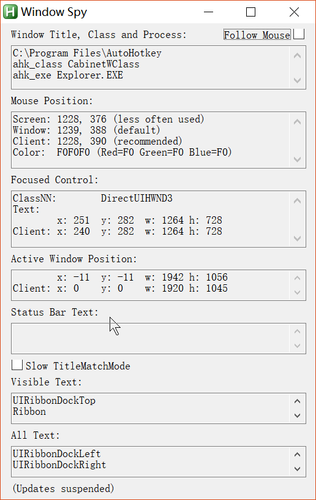

# 启动程序或文档

### run命令

```
;run exe file in environment path
Run Notepad

; 不在环境变量中的程序或文档
Run %A_ProgramFiles%\Winamp\Winamp.exe 

;open file
Run C:\My Documents\Address List.doc
Run C:\My Documents\My Shortcut.lnk

;open web link
Run www.yahoo.com
Run mailto:someone@somedomain.com
```

### runwait命令

程序或文档关闭后才继续执行脚本

```
RunWait Notepad
MsgBox The user has finished (Notepad has been closed).
```

### 单行命令和多行命令

单行命令

```
#n::Run Notepad
^!c::Run calc.exe
```

多行命令

```
#n::
Run http://www.google.com
Run Notepad.exe
return
```

# 发送键击和鼠标点击

### send命令

- 如果没有花括号 {}, 则将后跟参数以字符串输出
- 若发送键击, 则要用花括号括起来, 除非是
  - #: win
  - +: shift
  - ^: ctrl
  - !: alt

##### 举例

```
Send ^c!{tab}pasted:^v
```

会输出当前选中内容, 然后alt+tab切换界面,输出"pasted"字符串,再粘贴方才选中内容

### 鼠标点击

运行程序



将鼠标移动到对应程序上, window spy会显示对应的鼠标坐标和程序名及class名

##### 使用click命令

```
Click  ; 在鼠标光标的当前位置点击鼠标左键.
Click 100, 200  ; 在指定坐标处点击鼠标左键.
Click 100, 200, 0  ; 移动而不点击鼠标.
Click 100, 200 right  ; 点击鼠标右键.
Click 2  ; 执行双击.
Click down  ; 按下鼠标左键不放.
Click up right  ; 释放鼠标右键.
```

# 激活和操作窗口

- 激活当前置顶窗口 WinActivate

- 判断窗口是否存在 ifWinExist 或 WinWait

##### 举例

```
IfWinExist Untitled - Notepad ; IfWinExist 后跟程序标题(区分大小写
{
    WinActivate
}
else
{
    Run Notepad
    WinWait Untitled - Notepad ; 等待对应窗口出现
    WinActivate ; 激活对应窗口
}
```

### 常用命令

- IfWinActive: 检查指定的窗口当前是否活动.

- WinWaitActive: 等待指定窗口变为活动窗口 (通常用在激活窗口的键击后面, 例如按下 Control-F 来打开 "查找" 窗口).

- WinClose: 关闭指定的窗口.
- WinMove: 改变指定窗口的位置和/或大小.
- WinMinimize, WinMaximize, WinRestore: 分别最小化, 最大化或还原指定窗口.

